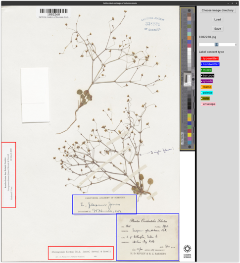

# Label Llama
## From 30,000 feet:
Extract information from labels on images of herbarium sheets.

There are 3 main steps:
1. Find all labels on the herbarium sheet.
2. OCR the text on the labels.
3. Extract information from the OCRed text.

Of course things are a bit more complicated than just those 3 steps.

### Given images of herbarium sheets

### Find labels on the sheet

Labels outlined in orange are considered scientifically interesting and the teal labels can be ignored.

### OCR text in the labels

OCRed text from the label on the lower right of the sheet.

### Find text text in the labels

This is clearly from another sheet and label. The colors indicate text matched to fields.

### Output text to structured fields

The text is formatted and placed into named fields using the Darwin Core format.

## The pipeline

### outline_labels.py

This is a GUI script used to mark labels on specimen images.
You draw colored boxes around labels on the sheet.
The colors correspond to the type of label.

I use this to generate training data for a "label finder" model.
I also use this to generate labels for the rest of the pipeline.

TODO:
-  Handle shrinking sheet images if the width is too small. I already do this for height.
- Resize canvas and images when the screen is resized. Adding scroll bars would be another option.
- Add a fast-forward button that takes you to the first unannotated sheet. Hitting it multiple times takes you to the next unannotated sheet.
- General GUI improvements to make it look better. Frames and styling.
- Maybe add keyboard shortcuts?
- Improve radio button selection visibility.
- Add mouse-over hints for the labels?

   

   In this figure of a herbarium sheet, I outlined the typewritten labels in red and handwritten labels in blue. I ignored envelopes, barcodes, etc.

### label_finder_input.py
TBD. Format the output of `outline_labels.py` for whatever model you're using for the label finder.

### Label finder model.
TBD.

### label_finder_output.py
TBD. Format the output of the label finder model into something the `cutout_labels.py` script can use.

### modify_outlined_labels.py
I use this script to update data in JSON data generated above in step one:

- If you move the directory of the original specimen images.
- I deleted the JSON file generated by `outline_labels.py`, but if I still have the label images themselves generated by `cutout_labels.py` I can regenerate the JSON file.

### cutout_labels.py

This takes the output from `outline_labels.py` and generates images of the labels themselves.

### OCR script. Not written by me. I am currently using `olmOCR`. If you use another OCR model you will have to format its output.
   1. `conda activate olmocr`
   2. `python -m olmocr.pipeline path/to/<workspace> --pdfs path/to/<label images>/*.jpg`

### format_ocr_output.py

Convert OCR output into LabelLlama format.

### run_lm.py

I use this script in 2 places:

1. To bootstrap annotation training data. The language models can help generate training data even without prior training. I will definitely need to run the generated data through the rest of the pipeline, but it helps.
2. Later in the pipeline where I do final inference.

### annotate_fields.py

A GUI script used to annotate label text that get used for training and scoring.

TODO:
- General improvements to the GUI.
- Add keyboard shortcuts?
- Improve radio button selection visibility.
- Add more information for the mouse-over popups.
- Improve error reporting.

### modify_annotated_fields.py

Used to add, delete, modify the annotated fields.

### train_lm.py

### score_lm.py

### show_lm_results.py

Show what the trained language model produces.

### run_lm.py Reprise

Run the language model for inference.
