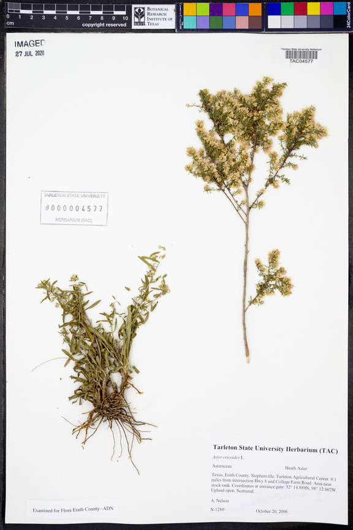
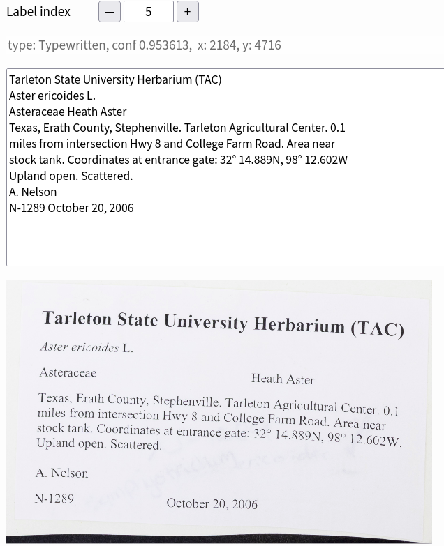
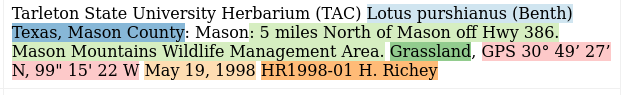
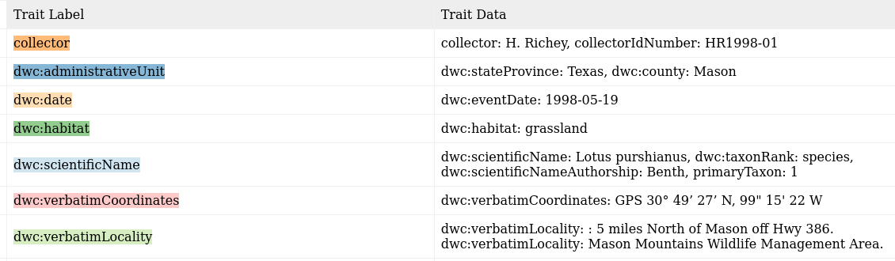

# Label Llamam

## The view from 30,000 feet

Extract information from labels on images of museum specimens.

### Given images of museum specimens



### OCR text on the images



OCRed text from the label on the lower right of the sheet.

### Find text text in the labels



This is clearly from another sheet and label.
The colors indicate text matched to fields.

### Output text to structured fields



The text is formatted and placed into named fields using the Darwin Core format.

## How to set up LabelLlama

You will need the python environment package manager called `uv` as well as `git`.

### Step 1: Clone this repository

```bash
git clone https://github.com/rafelafrance/LabelLlama.git
cd LabelLlama
```

### Step 2: Set up the environment using `uv`

```bash
uv sync
```

### Step 3: Set up LM-Studio to run local models

`lmstudio` is a wrapper and GUI around the `llama.cpp` library.
The GUI is convenient for downloading and running models locally.
Note you may run LM-Studio headless with `lms daemon`.
Of, course you don't have to run any models locally.
I use local models to OCR text on images of specimens and cleaning LM output some fields.

You can get the LM-Studio GUI and daemon [here](https://lmstudio.ai/)

## OCR images of museum specimens

### Start local OCR model

I run a local model to OCR images. I use (for now) Chandra-OCR on the LM-Studio daemon.

```bash
lms daemon up
lms server start
lms load chandra-ocr
```

Although these instructions are for LM-Studio, there is no reason why you can't use Ollama,
or llama.cpp or an external server to OCR the images. LabelLlama doesn't care.
Just change what LLM server you are pointing to.

### OCR script

The output file has 4 columns.

1. The status which is "success" or "error".
2. The "source" path, which is the image path in this case.
3. How long it took the OCR to run, "elapsed".
4. The OCR text itself, "text".

## Extract terms with an LLM

`parse_text.py` gets the raw field extracts from a Large Language Model (LLM).
The fields will contain hallucinations, interpretations, and odd notations,
all of which I try to fix in the next step.

### Parse script

If you want to use a hosted server for this you need to set up an account with payment information. The host will give you an API key which you need to put into the `LabelLlama/.env` file.

```
LLM_API_KEY=sk-my-key-like-an-openai-key
```

Note that the "text" column in the output file may be different from the raw input
in the OCR file. I run a text preprocessing step before sending it to the LLM.
I remove obvious header and footers.

I also join lines of text if there is only one line break (return) between them.
Labels have limited horizontal space, so sentences are split across multiple lines.
However, the models tend to do better if there are no line breaks in a sentence.
If there are two or more line breaks in a row then the breaks are likely to have
semantic meaning, but if there is only one break then it probably doesn't.

I want to record the exact text given to the LLM.

## Clean LLM output

This is where I clean up the oddities in the output from the LLM and put it into a usable format.
