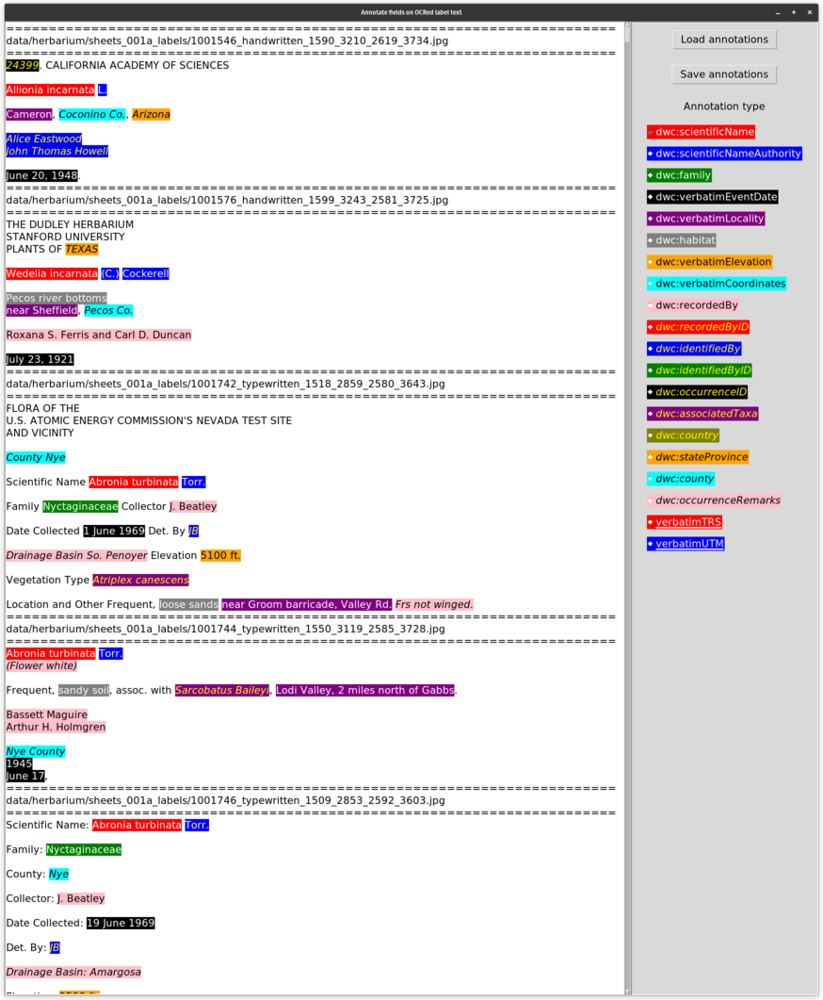

# Label Llama
## From 30,000 feet:
Extract information from labels on images of herbarium sheets.

There are 2 main steps:
1. OCR the text on herbarium sheets.
2. Extract information from the OCRed text.

Of course things are a bit more complicated than just those steps. The general idea here is that we want to build a simple AI pipeline. We are using Small Language Models (SLM) to do this. For now, there are 2 just models in the pipeline:
1. [olmOCR](https://olmocr.allenai.org/) is used to OCR the text on the herbarium sheets.
2. A possibly tuned version of [Gemma3](https://deepmind.google/models/gemma/gemma-3/) finds important plant annotations in the OCRed text.

### Given images of herbarium sheets

# TODO: Update the following

These steps and some of the scripts were written when SLMs were a lot less capable.

### Find labels on the sheet

The labels outlined in orange are target labels and those in teal may be ignored for our uses.

### OCR text in the labels

OCRed text from the label on the lower right of the sheet.

### Annotate text in the labels

This is clearly from another sheet and label. The colors indicate text matched to fields.

### Output text to structured fields

The text is formatted and placed into named fields using the Darwin Core format.

## Pipeline overview

1. OCR script.
2. `run_lm.py` I use this script in 2 places. Here it is used to bootstrap annotation training data. The language models can help generate training data even without prior training. I will definitely need to run the generated data through the rest of the pipeline, but it helps.
3. `annotate_fields.py` A GUI script used to annotate label text that get used for training and scoring.
    1. TODO:
        1. General improvements to the GUI.
        2. Add keyboard shortcuts?
        3. Improve radio button selection visibility.
        4. Add more information for the mouse-over popups.
        5. Improve error reporting.

    

4. `modify_annotated_fields.py` Used to add, delete, modify the annotated fields.
5. `train_lm.py`
6. `score_lm.py`
7. `show_lm_results.py` Show what the trained language model produces.
8. `run_lm.py` Reprise. Run the language model for inference.
