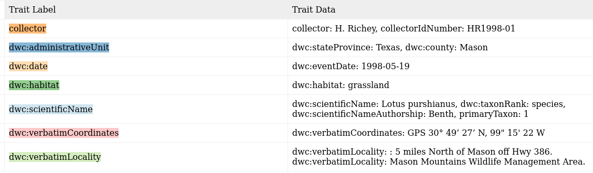

# Label Llama
## What the el?
Extract information from labels on images of herbarium sheets.

There are 3 main steps:
1. Find all labels on the herbarium sheet.
2. OCR the text on the labels.
3. Extract information from the OCRed text.

Of course things are a bit more complicated than just those 3 steps.

### Given images of herbarium sheets

### Find labels on the sheet

Labels outlined in orange are considered scientifically interesting and the teal labels can be ignored.

### OCR text in the labels

OCRed text from the label on the lower right of the sheet.

### Find text text in the labels

This is clearly from another sheet and label. The colors indicate text matched to fields.

### Output text to structured fields

The text is formatted and placed into named fields using the Darwin Core format.
